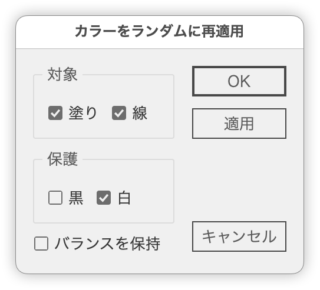

# カラーをランダム適用

---

### 概要

選択オブジェクト（パス／テキスト／複合シェイプ／グループ）に対して、
塗り／線カラーをランダムに再適用します。
除外条件（黒・白）や、カラーの使用比率を保つオプションも搭載。

### 処理の流れ

1. 対象オブジェクトを収集（グループ・複合パス含む）
2. 指定条件に基づいてカラーを収集
3. カラーをシャッフル
4. 対象オブジェクトに塗り／線を再適用

### 対象

- 選択中の PathItem / TextFrame / GroupItem / CompoundPathItem

### 限定条件

- RGB / CMYK カラーモード対応（内部的に RGB に変換して処理）

### バグ

- CMYK カラーの変換精度に注意（特に黒・白の扱い）
- 白、黒の保持の挙動に注意（除外条件の設定）

### 更新履歴：

- v1.0(2025-06-24) 初版リリース
- v1.2(2025-06-25) ランダム適用・順番適用の切替対応

