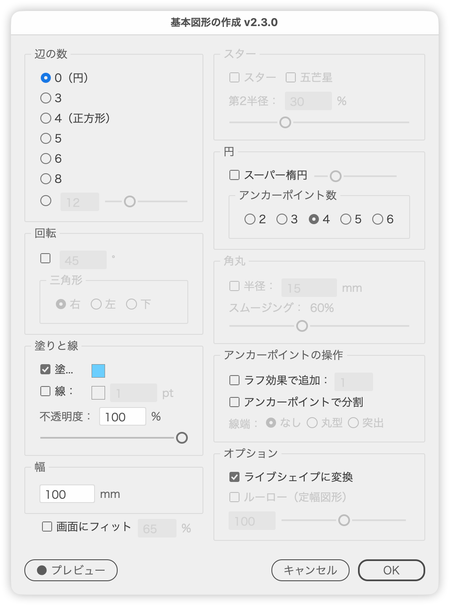

# 円・正多角形・スター・スーパー楕円・ルーローを作成

---

## 概要

円・正多角形・スター・スーパー楕円・ルーロー（定幅図形）を、1つのダイアログからまとめて作成するスクリプトです。

［長方形ツール］［楕円形ツール］［多角形ツール］［スターツール］を使い分けることなく、辺の数、幅、回転、塗りと線、角丸、アンカーポイントの各オプションを、プレビューを見ながら1箇所で設定できます。

### ムービー

https://youtu.be/EoUUIdbC0IU

## 主な機能

### 辺の数

- 0（円）／3／4／5／6／8 をラジオボタンで選択
- ［それ以外］で3〜36を入力欄またはスライダーで指定

### 円のオプション（辺の数＝0のとき）

- ［スーパー楕円］と、同じ行のスライダーで形状を決める指数（1.5〜6.0）
- アンカーポイント数を2／3／4／5／6から選択（4はIllustratorの楕円、それ以外は独自のスムーズパス）
- ［スーパー楕円］がONのときはアンカーポイント数を選べず、回転もOFFに固定されます

### スター（辺の数が1以上のとき）

- ［スター］をONにすると第2半径を%（第1半径＝幅に対する比率）で指定
- ［五芒星］をONにすると辺の数を5に設定し、5本の線分で構成されるよう角度を調整
- 第2半径の入力欄とスライダーは、［スター］がOFFのときディム表示になります

### 幅と回転

- 幅（サイズ）をIllustratorのルーラー単位で指定
- 回転角は入力欄で指定。∧∨（ステップボタン）や↑↓キーで次の整数へ増減（Shiftで次の10の倍数へ、Optionで±0.1）
- 辺の数を変えると、底辺が水平になる角度（360 ÷ 辺の数 ÷ 2、円は45°）を自動で入力欄に反映
- 辺の数が3のときは［三角形］パネルで向き（右／左／下）を選択

### 塗りと線

- 塗り・線のON／OFFと、スウォッチクリックによるカラーピッカー
- 線幅（Illustratorの線の単位に従う）
- 不透明度（0〜100%）を入力欄とスライダーで指定

### 角丸（辺の数＝4のとき）

- 半径を指定（初期値は幅の15%）
- スムージング（0〜150%）。0のときは［角を丸くする］効果、0より大きいときはスムージングを効かせた独自のベジェパスになります

### アンカーポイント

- ［ラフ効果で追加：］でアンカーポイントを追加（値1かつ円以外のときは［アンカーポイントの追加］コマンドを使用）
- ［アンカーポイントで分割］でアンカーごとに開いたパスへ分割し、線端（なし／丸型／突出）を指定

### オプション

- ［ライブシェイプに変換］で確定後にライブシェイプへ変換
- ［ルーロー（定幅図形）］で奇数辺の正多角形の各辺を円弧に変換。度合いは0〜200%（有効化のたび100%に戻ります）

### その他

- リアルタイムプレビュー（Undo履歴を汚さず、確定した結果は1ステップで取り消せます）
- ［画面にフィット］で、［幅］を変えるたびに図形が収まるよう表示倍率を合わせる。ウィンドウに対する大きさを％で指定（初期値65%、キャンセルすると元の表示に戻ります）
- ダイアログの位置と設定をIllustratorの起動中のみ保持
- 日本語／英語UI

## 使い方

1. ドキュメントを開いた状態で `SmartShapeMaker.jsx` を実行します。
2. ダイアログで辺の数、幅、各オプションを設定します。
3. プレビューを見ながら数値を調整します。
4. ［OK］をクリックすると、ドキュメントウィンドウの中央に図形が作成されます。

## キーボードショートカット

| キー | 動作 |
| --- | --- |
| E | 円（辺の数＝0） |
| A | ［回転］の切り替え |
| S | ［スター］の切り替え |
| P | ［五芒星］の切り替え |
| D | ［アンカーポイントで分割］の切り替え |
| L | 三角形（左）。辺の数を3にします |
| R | 三角形（右）。辺の数を3にします |
| B | 三角形（下）。辺の数を3にします |
| option（Alt）＋3・4・5・6・8 | 辺の数を選択（入力欄の編集中でも有効） |

## 標準ツールでなく、このスクリプトを使うメリット

- 4つのツールを使い分ける必要がなくなる
- 正多角形の辺の数に応じて、自動的に回転角を提示するオプションを使える
- スピンボタンでなく、ラジオボタンで選べる
- ［OK］ボタンを押す前にプレビューが見える（特に［スターツール］）
- 辺数：5で、5本の線分で構成されるように角度を自動調整する［五芒星］オプションを使える
- 星形の第2半径は、長さでなく、%で指定できる（第1半径＝幅です）
- スーパー楕円、ルーロー（定幅図形）、角丸のスムージングなど、標準ツールにない形状を作れる

## 注意事項

- 数値の単位はIllustratorのルーラー単位の設定に従います。線幅だけは線の単位に従います。
- 図形はアートボードではなく、ドキュメントウィンドウの中央に作成されます。
- ［ライブシェイプに変換］は、［アンカーポイントで分割］／［スーパー楕円］／円のアンカー数が4以外／［ルーロー］／［ラフ効果で追加］／角丸のいずれかが有効なときは選べません。
- ［ルーロー］は奇数辺（3、5、7…）の正多角形のみが対象で、スターとは併用できません。
- ［五芒星］または［スーパー楕円］が有効なときは、回転がOFFに固定されます。
- ［アンカーポイントで分割］はダイアログを開くたびにOFFに戻ります。
- ダイアログの位置と設定はIllustratorの起動中のみ保持され、再起動でリセットされます。

## 原案・参考

- 原案：宮澤聖二さん（三階ラボ）
- 角丸のスムージング：黒野真吾さん [Illustratorで角丸のスムージングを再現する](https://note.com/shingokurono/n/n348a3e73a465)

## 紹介記事

[【Illustrator】正方形や正円、正三角形を作成するスクリプト｜DTP Transit 別館](https://note.com/dtp_tranist/n/n005a7087f9c3)

## 更新履歴

- v2.4.2 (2026-09-28): ボタン行を共通の部品で組むようにした。キーボードショートカットを共通の部品にした（⌘などを押しているときは反応しない）
- v2.4.1 (2026-09-28): ダイアログを前回閉じた位置で開き、選択中のオブジェクトに重なるときは左右にずらすようにした。不透明度を97%にそろえた
- v2.4.0 (2026-09-27): 数値欄にステップボタン（∧∨）を追加。↑↓キーもステップボタンと同じ処理で増減するように変更（次の整数へ、shift＋で次の10の倍数へ）
- v2.3.0 (2026-09-27): ［画面ズーム］スライダーを削除。［画面にフィット］に大きさ（％）の入力欄を追加し、初期値を65%に。キャンセル時に表示位置も元に戻すように。option（Alt）＋3・4・5・6・8で辺の数を選ぶショートカットを追加。［4（正方形）］の表記、［塗り：］［線：］にコロン、スムージングの値に％を表示、［スーパー楕円］の指数をチェックボックスと同じ行のスライダーだけに、［アンカーポイント数］パネル名・［ライブシェイプに変換］など文言を調整。ツールチップを追加。内部の重複処理を整理
- v2.2.4 (2026-09-27): 数値欄で小数点を入力できない不具合を修正（↑↓以外のキーでも値を書き戻していた）。単位の扱いを共通の単位表に統一（歯（H）・ft・yd・m に対応、インチの表示を「in」に）。英語版のダイアログタイトルを「Create Basic Shapes」に変更。各項目にツールチップを追加。項目名のコロン付けを共通化
- v2.2.3 (2026-09-21): ダイアログのタイトルに、本体ではなく ColorPicker.jsx のバージョンが表示される不具合を修正。カラーのスウォッチをクリックしてもカラーピッカーが開かない不具合を修正（ColorPicker.jsx v1.0.2）
- v2.2.0 (2026-07-31): 基本情報ブロックとJSDocを整備、全体をIIFE化、変数名・パネル名を整理。［OK］確定時のパラメーター取得タイミングを修正
- v1.0.0 (2025-05-02): 初期バージョン
