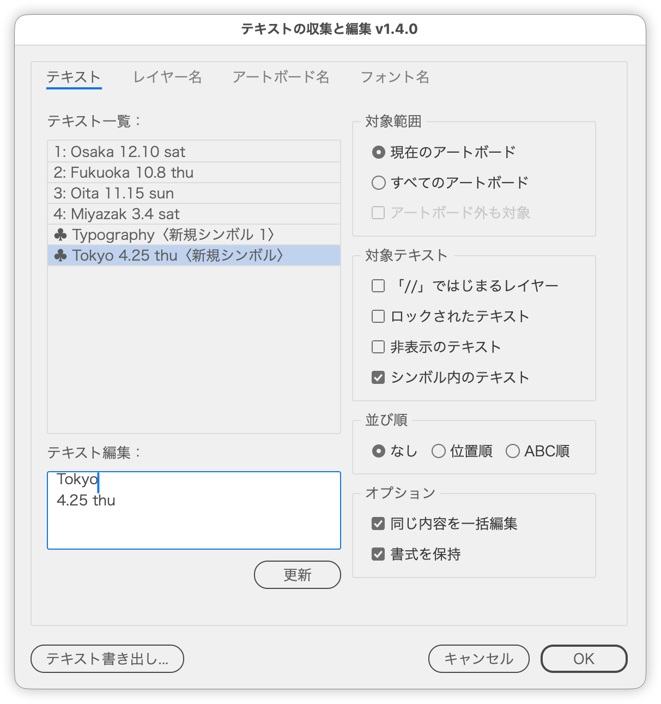

# テキストを一覧で編集してドキュメントに書き戻す

---

### 概要

ドキュメント内のテキスト（シンボル内を含む）を一覧にし、書式を保ったまま編集してドキュメントへ書き戻します。
レイヤー名・アートボード名・フォント名の一覧を確認したり、テキストとフォント名をテキストファイルに書き出したりもできます。

### 主な機能

- ［テキスト］タブ：対象のテキストを一覧にして、選んだ行を編集
  - シンボル内のテキストは一覧の末尾に ♣ 付きで並び、同じように編集できます
  - ［更新］で編集をドキュメントに反映し、ダイアログを閉じずに次の行を編集できます
- ［レイヤー名］［アートボード名］タブ：名前の一覧を表示
- ［フォント名］タブ：使われているフォント（シンボル内を含む）を一覧にし、行をクリックするとそのフォントのテキストを選択
- ［テキスト書き出し...］：テキストとフォント名をアートボードごとにまとめて、デスクトップにテキストファイルで書き出し
- ［テキストをコピー］：テキスト一覧に並んでいるテキストを省略せずにクリップボードへコピー

### 使い方

1. スクリプトを実行します。
2. ［対象範囲］［対象テキスト］で一覧に並べるテキストを決めます。
3. ［テキスト一覧］で行を選び、［テキスト編集］で書き換えます。
4. 続けて編集するときは［更新］、終えるときは［OK］を押します。

強制改行は Shift+Enter で入力します（編集欄では `@#` と表示されます）。

### オプション

| 項目 | 内容 |
|---|---|
| 対象範囲 | ［現在のアートボード］／［すべてのアートボード］。［アートボード外も対象］でドキュメント全体に広げます |
| 対象テキスト | 「//」ではじまるレイヤー、ロック・非表示のテキスト、シンボル内のテキストを含めるか |
| 並び順 | なし／位置順（上から下、同じ高さは左から右）／ABC順 |
| 同じ内容を一括編集 | 同じ内容のテキストを1行にまとめ、編集をすべてに反映します |
| 書式を保持 | 変えた文字だけを書き換え、文字・段落の書式を残します。オフにすると全体が1文字目の書式になります |

### 注意点

- シンボル内テキストを編集すると、シンボルの定義を書き換えます。範囲外にある同じシンボルのインスタンスも変わり、基準点などのシンボルオプションは初期値になります。
- ［更新］で反映した編集は、［キャンセル］しても元に戻りません（Illustrator の取り消しで戻せます）。

### 紹介記事

https://note.com/dtp_tranist/n/nb845889dd553

### 更新履歴

- v1.5.0 (2026-09-26)
  - ［テキストをコピー］を追加しました（TextExport.jsx の機能を統合）
- v1.4.0 (2026-09-26)
  - シンボル内のテキストを編集できるようにしました（［対象テキスト］に［シンボル内のテキスト］を追加）
  - ロックされたグループや親レイヤー内のテキストも書き換えられるようにしました
  - ［段落書式を保持］を［書式を保持］に改め、変更した文字だけを書き換えるようにしました（2行目の1文字目を変えると1行目の書式になる不具合を修正）
  - テキスト編集の下に［更新］を追加し、ダイアログを閉じずに続けて編集できるようにしました
  - ［フォント名］タブとフォント名の書き出しに、シンボル内のテキストのフォントも含めるようにしました
  - 書き出し後に選択が解除されていた不具合、フォント選択で名前の一部が一致するフォントまで選ばれていた不具合を修正しました
  - ［プレビュー］を廃止し、編集のオプションを［オプション］パネルにまとめました
  - パネル名・項目名などの文言を見直しました（［カンバス］タブ→［テキスト］タブなど）
- v1.3.6 (2026-04-08)
