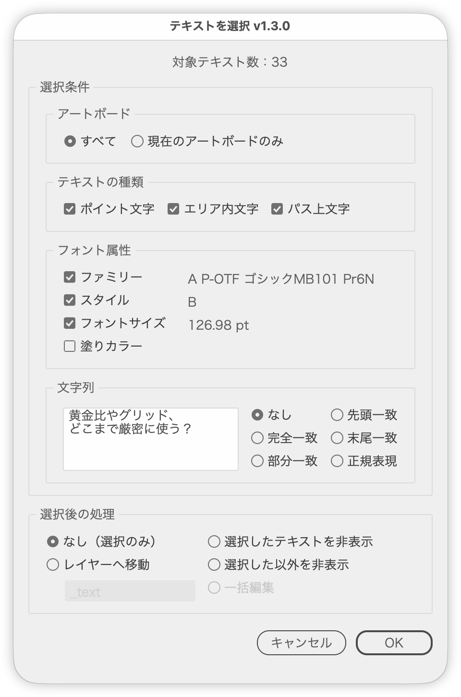

# 複数の条件でテキストフレームを一括選択

---

### 概要

ドキュメント内のテキストフレームを、複数の条件で一括選択します。

### 主な機能

- フォント属性: 選択中テキストを基準に、ファミリー／スタイル／フォントサイズ／塗りカラーのチェックボックスで検索（オンにした属性がすべて一致するもの）
- テキストの種類: ポイント文字／エリア内文字／パス上文字（チェックボックス、初期値はすべてオン）
- 文字列: なし／完全一致／部分一致／先頭一致／末尾一致／正規表現（フォント属性と組み合わせて「この文字列で、このフォント」も指定可）
- 選択後の処理: なし（選択のみ）／選択したテキストを非表示／選択した以外を非表示／レイヤーへ移動（移動先は変更可、初期値「_text」）／一括編集

### 使い方

1. （フォント属性で絞り込む場合は）基準にするテキストを選択します。
2. スクリプトを実行します。
3. 条件と選択後の処理を指定して実行します。

- ダイアログの最上部に、今の条件で選ばれるテキストの数が出ます。
- ［フォント属性］のチェックボックスは、Option＋クリックですべてオン、もう一度でクリックしたもの以外をオンにします。
- 一括編集の欄では、［改行］［強制改行］ボタンか Shift+Enter で改行を入れられます（強制改行は `@#` と表示）。

#### キーボードショートカット

| キー | 操作 |
|---|---|
| Option＋W／E／T | ［ポイント文字］［エリア内文字］［パス上文字］のオン／オフ |
| Option＋A／I／B／D／R | ［完全一致］［部分一致］［先頭一致］［末尾一致］［正規表現］ |

検索文字列の欄に入力している間は効きません。

### 注意点

- レイヤーへ移動する場合、既存レイヤーのロック・可視状態は復元します。
- 一括編集は、テキストの内容をまとめて置き換えます。文字ごとの書式は元の文字の位置ごとに残り、元より長くなった分は元の最後の文字の書式になります。空のテキストは変えません。

### 紹介記事

https://note.com/dtp_tranist/n/n76f1e0937088

### 更新履歴

- v1.2.5
- v1.2.7 (2026-09-28) : ダイアログを前回閉じた位置で開き、選択中のオブジェクトに重なるときは左右にずらすようにした。不透明度を97%にそろえた
- v1.2.8 (2026-09-28) : ボタン行を共通の部品で組むようにした
- v1.2.8 (2026-09-28) : キーボードショートカットを共通の部品にした（⌘などを押しているときは反応しない）
- v1.2.9 (2026-09-29) : ダイアログの不透明度を98%に変更
- v1.2.10 (2026-09-30) : 文字ツールで文字を選択して実行するとエラーになる不具合を修正
- v1.2.11 (2026-09-30) : 右側のボタンだけのボタン行を左右中央に並べるようにした
- v1.2.12（2026-10-01）右側のボタンだけの行は、ダイアログの内側の幅（左右の余白を除く）が 200px 以内なら中央、それより広ければ右揃えに変更
- v1.2.13（2026-10-01）ウィンドウ・パネルの余白と間隔を共通部品（UIレイアウト）にそろえた
- v1.2.14（2026-10-01）ボタン行の下に余白を加え、Illustrator 標準のダイアログに合わせた
- v1.2.15（2026-10-03）異なるフォントなどのテキストを複数選択して実行したとき、属性の表示を最初のテキストの値ではなく「混在」にした
- v1.2.16（2026-10-03）テキストを複数選択して実行したとき、［文字列で選択］をディム表示にした（検索文字列の欄が広がらないように）
- v1.3.0（2026-10-03）ダイアログの最上部に「対象テキスト数：3」のように対象の数を表示。検索文字列の欄を複数行にして高くした。［属性で選択］を［フォント関連の属性で選択］にし、フォントファミリー／スタイル／フォントサイズ／塗りカラーのチェックボックスに変更（組み合わせはスクリプトで照合、Illustrator 標準コマンドは使わない）。［不透明度］は削除。［文字列で選択］に［なし］を加え、フォント関連の属性と同時に検索できるようにした。属性のチェックボックスは Option＋クリックですべてオン、もう一度でそれ以外をオン。［選択後の処理］［文字列で選択］の条件を2列に。［選択後の処理］の［なし］を［なし（選択のみ）］に、移動先のレイヤー名を変更できるようにした。［テキストの種類］をチェックボックスの絞り込みにし、属性・文字列と組み合わせられるようにした（初期値はすべてオン、パス上文字は Option＋T）。［一括編集］は［文字列で選択］の条件を選んでいるときだけ使えるようにし、改行・強制改行をボタンと Shift+Enter で入れられるようにした。UI の文言とヒント文を見直し、パネル名を［アートボード］［テキストの種類］［フォント属性］［文字列］にした。ショートカットのキーはツールチップの末尾に表示。コードを整理（ダイアログの組み立てをパネルごとに分け、ラジオ・チェックボックスを対応表から作る）。一括編集でテキスト全体が先頭の文字の書式になる不具合を修正
