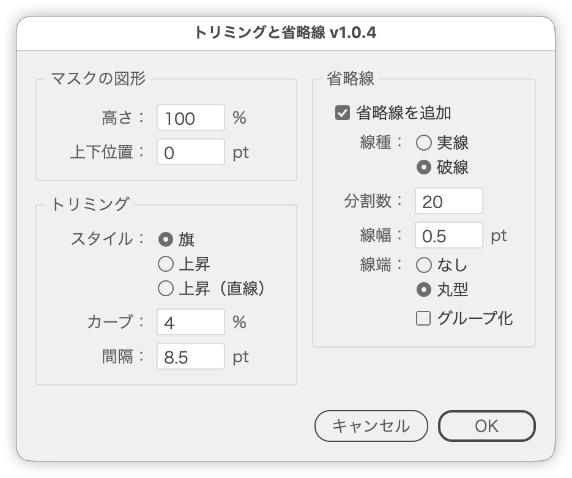

# 画像を省略線でトリミング

---

### 概要

- オブジェクト（画像・グループ・パスなど）と、その上に描いたパスを選択して実行すると、パスの範囲を省いた2つのパーツを作り、指定の間隔に詰めます。
- 対象を横にまたぐパスなら上下に、縦にまたぐパスなら左右に切り分けます（対象に対するまたぎ具合から自動で判定）。
- パスが対象の端（上端など）まで覆っているときは、覆っている側だけを残し、反対側を切り落とした1つのパーツを作ります。
- 長い画面キャプチャやメニューの一部を省略して見せたいときに使います。
- 切り口はワープ（旗・上昇・上昇（直線））で曲げられ、切り口に沿った省略線も引けます。

### 主な機能

- マスク用のパスの幅（左右に切るときは高さ）でトリミング
- 切る方向を自動判定（上下／左右）
- 切り口の形を「旗」「上昇」「上昇（直線）」から選択、カーブの量を%で指定
- 2つの切り口は同じ形なので、詰めたあとも一定の間隔でかみ合う
- パスが対象の端を覆っているときは、その側だけを残すトリミング（省略線は1本）
- パーツ同士の間隔を、定規の単位で指定
- 切り口に沿った省略線（実線／破線、分割数、線端）を追加
- 省略線を、その切り口のパーツとグループ化
- ダイアログを開いた時点からのライブプレビュー
- 前回の設定を復元（`~/Library/Application Support/TrimWithBreakLine/settings.txt`）
- 距離は定規の単位、線幅は「線」の単位（環境設定 › 単位）で入力

### 使い方

1. 対象のオブジェクト（画像・グループ・パスなど）の上に、省略したい範囲を覆う長方形などのパスを描き、2つを選択する（片側だけ残すときは、残したい範囲を端まで覆うように描く）
2. スクリプトを実行する
3. ダイアログで切り口の形・間隔・省略線を指定する（プレビューを見ながら調整）
4. OK で確定する。元のオブジェクトとマスク用のパスは削除され、できたパーツが選択された状態になる

パスはマスク用の図形として扱い、切る方向と直交する側の大きさが仕上がりのサイズになります（対象もパスの場合は前面にあるほうがマスク）。切る方向は、パスが対象の幅・高さをどれだけまたいでいるかで決まります。

マスク用の図形を切る方向の両端（上下に切るなら対象の上端・下端）より内側に描くと、その範囲を省いた2つのパーツになります。片方の端を覆うように描くと、覆っている側だけを残した1つのパーツになります（このとき「間隔」は使いません）。両端とも覆っていると実行できません。

### ダイアログ

| 項目 | 説明 |
| --- | --- |
| 高さ／幅 | マスク用の図形の、切る方向の大きさ（%）。100%で描いたとおり。項目名は方向で切り替わる |
| 上下位置／左右位置 | マスク用の図形の位置（定規の単位）。プラスで下・右へ、マイナスで上・左へ |
| スタイル | 切り口の形。「旗」は波、「上昇」は右上がりのカーブ、「上昇（直線）」は右上がりの直線 |
| カーブ | 切り口を曲げる量（0〜100%）。0で直線 |
| 間隔 | 詰めたあとの2つのパーツのあいだの距離（定規の単位）。片側だけ残すときは使わない |
| 省略線を追加 | 切り口に沿った省略線を引く |
| 線種 | 実線／破線 |
| 分割数 | 破線の線分の本数。線分と間隔は同じ長さで、両端が線分で終わる |
| 線幅 | 省略線の線幅（「線」の単位） |
| 線端 | なし（線端なし）／丸型（丸型線端） |
| グループ化 | 省略線を、その切り口のパーツとひとつのグループにまとめる |

### キーボード操作

| キー | 動作 |
| --- | --- |
| ↑ / ↓ | 数値欄の値を1ずつ増減 |
| Shift + ↑ / ↓ | 10の倍数へスナップ |
| option + ↑ / ↓ | 0.1ずつ増減 |

### 注意事項

- 選択はオブジェクト1つ＋パス1つの2つだけにしてください。
- マスク用のパスが、切る方向の両端にかかっていると実行できません。
- 線の濃さはスクリプト冒頭の `RULE_STROKE_GRAY` で変更できます。
- OKで実行すると設定が保存され、次回のダイアログに引き継がれます。
- プレビューは複製で作っています。キャンセルすると複製は削除され、元の選択に戻ります。

### 紹介記事

- [DTP Transit 別館](https://note.com/dtp_tranist/n/n2483bd96e284)

### 更新履歴

- v1.0.4 (20260921) : パスが対象の端を覆っているときは、その側だけを残すトリミングに対応。切り口のスタイルに「上昇（直線）」を追加。ラジオボタン（スタイル・線種・線端）を縦並びにし、数値欄を1文字分短くした
- v1.0.3 (20260921) : 切る方向の判定を、対象に対するまたぎ具合で行うように修正。UI文言を「省略線」に統一し、線幅・間隔・位置のツールチップを実際の単位と方向に合わせた
- v1.0.2 (20260921) : 左右に切り分ける動作（切る方向の自動判定）、画像以外のオブジェクト、前回設定の復元に対応。「マスクの図形」パネル（高さ・上下位置）、省略線の線幅を追加。距離は定規の単位、線幅は「線」の単位に
- v1.0.1 (20260921) : 初期バージョン
