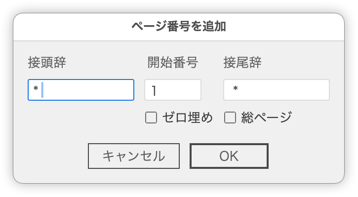

# ページ番号を挿入

---

### 概要:
_pagenumberレイヤー上で選択されたテキストを基準に、すべてのアートボードに連番テキストを複製します。

- ユーザーは開始番号・接頭辞・ゼロパディング・総ページ数表示を指定可能。
- アートボード数に応じてページ番号を自動生成します。

### 制約:

- 複製元テキストは_pagenumberレイヤー上のポイントテキストであること
- 段落揃えの変更は行いません

### 更新履歴

作成日：2025-06-25
更新日: 2025-06-28
- v1.0.0 初版
- v1.0.1 テキスト複製ロジック修正
- v1.0.2 ゼロ埋め・接頭辞・総ページ数表示追加
- v1.0.3 プレビュー機能を追加
- v1.0.4 「001」のようなゼロ埋め対応
- v1.0.5 接尾辞フィールド追加し、ダイアログボックスのUIを変更

課題：
- プレビュー時、元のテキストが残ってしまい重複して見える問題があります。OKボタンを押すと消えます。

- v1.0.4 「001」のようなゼロ埋め対応
- v1.0.5 接尾辞フィールド追加し、ダイアログボックスのUIを変更

